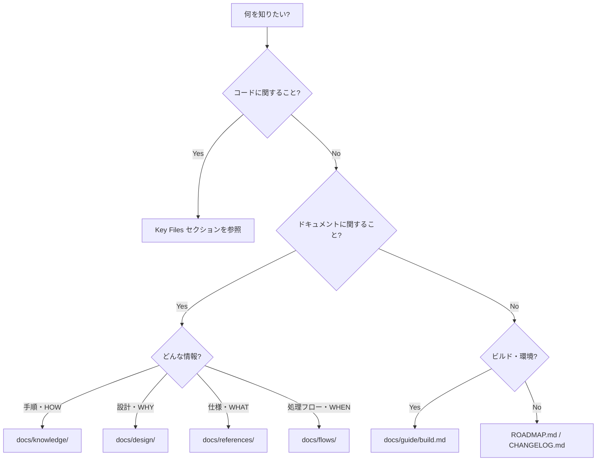

# VoiceTerm - Development Instructions

## TL;DR - 目的別クイックナビゲーション

| やりたいこと | 参照先 |
|-------------|--------|
| プロジェクトの全体像を知りたい | このファイル → [Project Overview](#project-overview) |
| ビルドしたい | [docs/guide/build.md](docs/guide/build.md) |
| 実機にインストールしたい | [docs/guide/device-setup.md](docs/guide/device-setup.md) |
| WSL2環境を構築したい | [docs/knowledge/wsl-setup.md](docs/knowledge/wsl-setup.md) |
| ドキュメントを書きたい | [docs/guide/documentation.md](docs/guide/documentation.md) |
| ドキュメント全体を探索したい | [docs/README.md](docs/README.md) |
| ロードマップを確認したい | [ROADMAP.md](ROADMAP.md) |
| 変更履歴を確認したい | [CHANGELOG.md](CHANGELOG.md) |

## 情報の探し方（決定木）



## Knowledge Base

ドキュメントは4層に分類されています。詳細は [docs/README.md](docs/README.md) を参照。

| カテゴリ | 役割 | ディレクトリ |
|---------|------|-------------|
| Guide | 開発ガイド・手順書 | [docs/guide/](docs/guide/) |
| Knowledge | 実践的知識（HOW） | [docs/knowledge/](docs/knowledge/) |
| Design | 設計思想（WHY） | [docs/design/](docs/design/) |
| References | 外部仕様（WHAT） | [docs/references/](docs/references/) |
| Flows | 処理フロー（WHEN/WHERE） | [docs/flows/](docs/flows/) |

---

## Project Overview

VoiceTermは、日本語入力と音声認識に対応したAndroid向けSSHクライアントです。
ConnectBotをベースにフォークし、独自の入力機能を追加しています。

## Tech Stack

- Language: Kotlin (primary), Java (legacy)
- Min SDK: 21 (Android 5.0)
- Build: Gradle (Kotlin DSL)
- Base: ConnectBot (Apache 2.0)

## Project Structure

```
app/
├── src/main/
│   ├── java/org/connectbot/    # メインソースコード
│   ├── res/                     # リソース (layouts, strings, etc.)
│   └── AndroidManifest.xml
├── build.gradle.kts
docs/                            # ドキュメント（4層分類）
├── guide/                       # 開発ガイド
├── knowledge/                   # 実践的知識
├── design/                      # 設計思想
├── references/                  # 外部仕様
└── flows/                       # 処理フロー
fastlane/                        # リリース自動化 (後で追加)
```

## Key Files

- `app/src/main/java/org/connectbot/ConsoleActivity.java` - ターミナル画面
- `app/src/main/java/org/connectbot/TerminalView.java` - ターミナル描画
- `app/src/main/java/org/connectbot/ui/components/FloatingTextInputDialog.kt` - 入力バー + 音声認識
- `app/src/main/res/drawable/ic_launcher_foreground.xml` - アイコン前景（マイク + 波形）
- `app/src/main/res/drawable/ic_launcher_background.xml` - アイコン背景（ティール）
- `app/src/main/res/layout/` - UIレイアウト

## Development Rules

### Code Style
- Kotlinを優先、新規コードはKotlinで書く
- 既存のJavaコードは必要に応じてKotlinに移行
- ConnectBotのコードスタイルを尊重

### Git Workflow
- mainブランチに直接push OK (個人開発)
- 機能追加時はfeatureブランチ推奨
- コミットメッセージは日本語OK

### Testing
- 実機テスト必須 (エミュレータでSSHは動作確認しにくい)
- 日本語入力は複数のIMEでテスト (Gboard, Google日本語入力等)

## Implemented Features

### 1. Japanese Input (日本語入力対応)
- 非モーダル入力バー (`FloatingTextInputDialog.kt`)
- IMEで確定後にSSHへ送信
- ターミナル直接入力との切り替え

### 2. Voice Recognition (音声認識)
- Android SpeechRecognizer API
- 音声入力ボタン（マイクアイコン）
- 自動送信タイムアウト選択

### 3. Branding (ブランディング)
- パッケージ名: `com.voiceterm.app`
- アイコン: ティール背景 + マイク中央 + 音声波形 + ターミナルプロンプト
- Adaptive Icon + モノクロ版 + レガシーPNG対応

## Features to Implement

### 4. Monetization (収益化)
- AdMobバナー広告
- 広告非表示 (課金)
- 音声入力無制限 (課金)
- 音声入力回数制限ロジック

### 5. Release (リリース)
- Fastlaneでのリリース自動化
- Google Play Store公開
- プライバシーポリシー作成

## Build Commands

```bash
# Debug build (Google flavor)
./gradlew assembleGoogleDebug

# Release build
./gradlew assembleGoogleRelease

# Install to device (WSL環境ではWindows側のadbを使用)
"/mnt/c/Users/ken imoto/AppData/Local/Android/Sdk/platform-tools/adb.exe" install app/build/outputs/apk/google/debug/app-google-debug.apk

# EasyLauncherキャッシュ問題時はクリーンビルド
./gradlew clean assembleGoogleDebug --no-build-cache
```

## Environment Setup

1. Android Studio (latest stable)
2. Android SDK 21+
3. 実機またはエミュレータ
4. Fastlane (リリース時)

詳細は [docs/knowledge/wsl-setup.md](docs/knowledge/wsl-setup.md) を参照。

## Notes

- ConnectBotのライセンス表記を維持すること (Apache 2.0)
- 課金実装時はGoogle Play Billing Library使用
- リリースはFastlane経由で自動化
