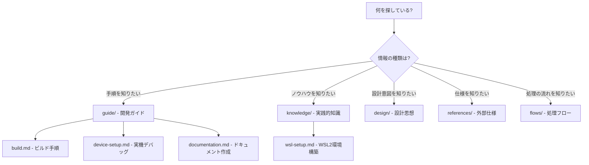

# VoiceTerm ドキュメント

## クイックスタート

| 順番 | ドキュメント | 内容 |
|------|-------------|------|
| 1 | [CLAUDE.md](../CLAUDE.md) | プロジェクト全体像・開発ルール |
| 2 | [WSL2セットアップ](knowledge/wsl-setup.md) | 開発環境構築 |
| 3 | [ビルドガイド](guide/build.md) | ビルド・インストール方法 |
| 4 | [実機デバッグ](guide/device-setup.md) | 実機接続・テスト |

## ドキュメントの探し方



## ディレクトリ構造

```
docs/
├── README.md                  # このファイル（全体インデックス）
├── _templates/                # ドキュメントテンプレート
│   ├── flow.md                # Flowテンプレート
│   └── knowledge.md           # Knowledgeテンプレート
├── guide/                     # 開発ガイド（手順書）
│   ├── README.md              # ガイド一覧
│   ├── build.md               # ビルド手順
│   ├── device-setup.md        # 実機デバッグ
│   └── documentation.md       # ドキュメント作成ガイド
├── knowledge/                 # 実践的知識（HOW）
│   ├── README.md              # ナレッジ一覧
│   └── wsl-setup.md           # WSL2環境構築
├── design/                    # 設計思想（WHY）
│   └── README.md              # インデックス
├── references/                # 外部仕様（WHAT）
│   └── README.md              # インデックス
└── flows/                     # 処理フロー（WHEN/WHERE）
    └── README.md              # インデックス
```

## 4層情報分類

VoiceTermのドキュメントは以下の4層に分類されています。

| カテゴリ | 問いかけ | 内容 | 例 |
|---------|---------|------|-----|
| **Knowledge** | HOW - どうやるか? | 環境構築、トラブルシューティング等の実践的知識 | WSL2セットアップ |
| **Design** | WHY - なぜそうしたか? | アーキテクチャ選定理由、設計判断の記録 | （今後追加） |
| **References** | WHAT - 何が定義されているか? | 外部API仕様、ライブラリのインターフェース | （今後追加） |
| **Flows** | WHEN/WHERE - いつ・どこで動くか? | データフロー、処理シーケンス | （今後追加） |

**Guide** はこれらの横断的な手順書で、複数のカテゴリの知識を組み合わせた開発ガイドです。

## ドキュメント作成

新しいドキュメントを追加する場合は [ドキュメント作成ガイド](guide/documentation.md) を参照してください。
テンプレートは `_templates/` に用意されています。

## 品質基準

- 全ドキュメントにFrontmatter（YAML）を付与する
- 関連ドキュメントへの相互リンクを設定する
- 1ファイルあたり300行以内を目安とする（LLMのコンテキスト効率）
- 具体的なコマンド例を含める
