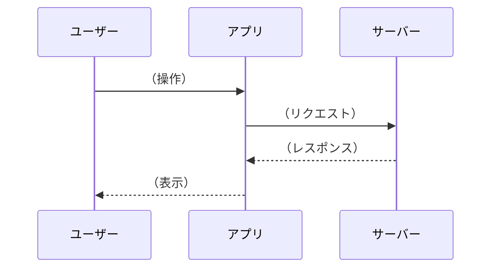

# （フロー名）

## 概要

（このフローが何を記述しているか、1-2文で説明）

## トリガー

- （このフローが開始される条件）

## フロー図

## ステップ詳細

### 1. （ステップ名）

- **トリガー**: （何がこのステップを開始するか）
- **処理**: （何が行われるか）
- **出力**: （結果は何か）
- **該当コード**: `path/to/file.kt:行番号`

### 2. （ステップ名）

- **トリガー**:
- **処理**:
- **出力**:
- **該当コード**:

## エラーケース

| ケース | 発生条件 | 対処 |
|-------|---------|------|
| （エラー名） | （条件） | （対処方法） |

## 関連

- （関連ドキュメントへのリンク）
